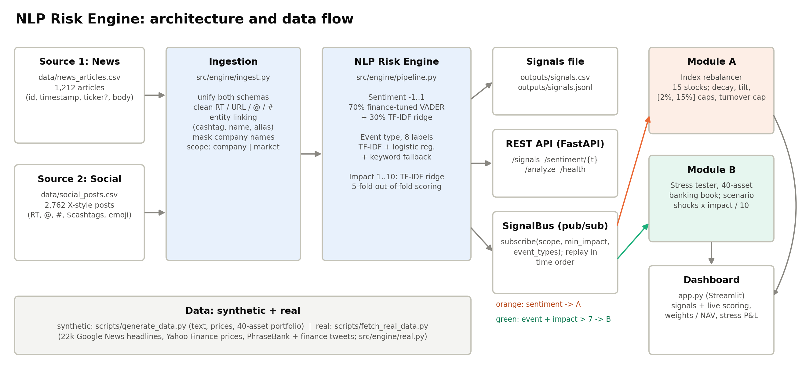
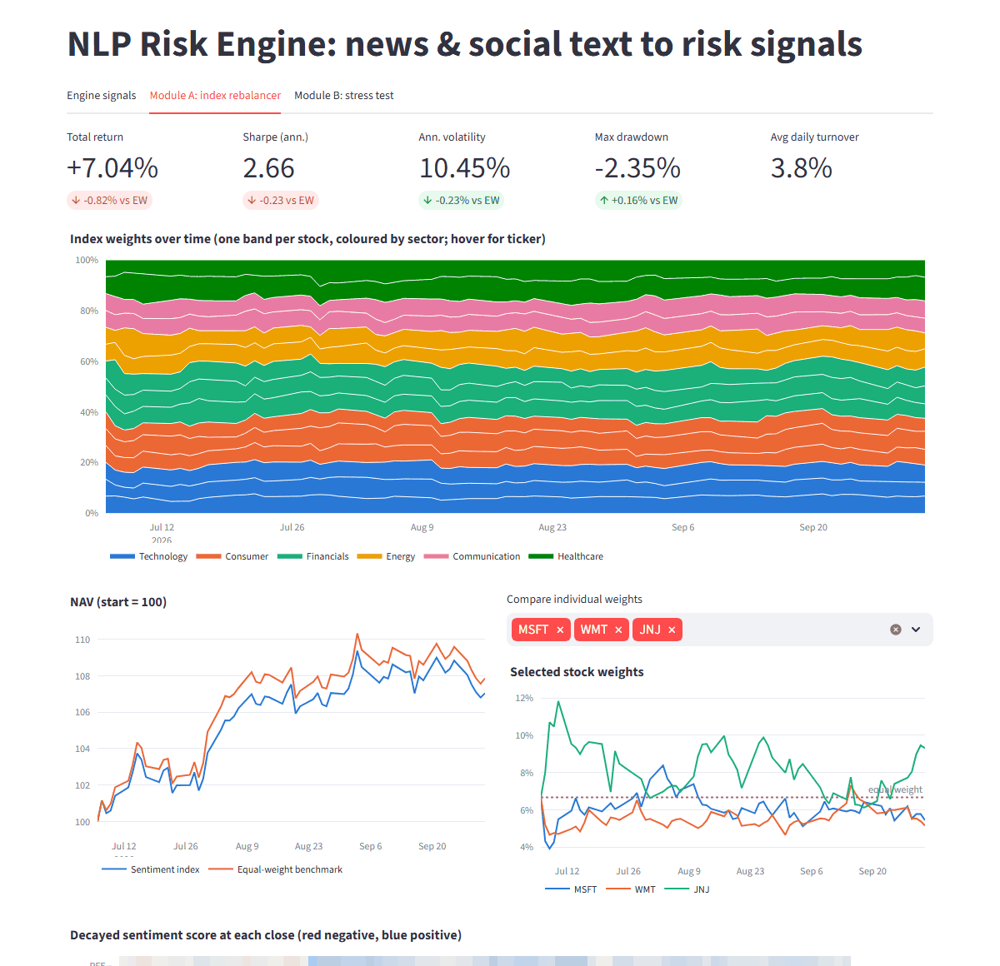
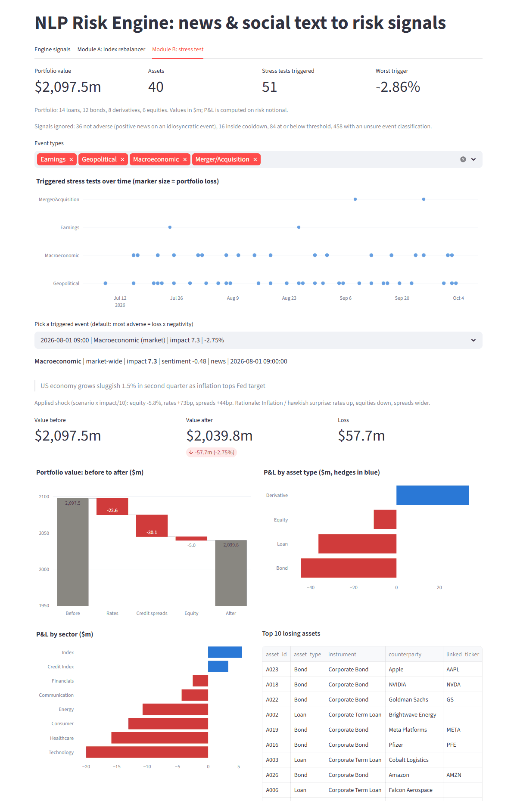

# NLP Risk Engine: Sentiment Index Rebalancer & Event-Driven Stress Tester - S&P Global & Crisil Campus Hackathon

**Candidate Name:** Mehwish
**College Email ID:** mehwish.2023@vitstudent.ac.in
**College / Campus:** VIT
**Demo Video Link:** [YouTube (unlisted) link - to be added]
**Slide Deck Link (if hosted externally):** not hosted externally; the deck is in the repo at [`docs/presentation.pdf`](docs/presentation.pdf)

## 1. Project Overview / Problem Statement & Approach

Market-moving information arrives as unstructured text: news articles, analyst notes and social-media chatter. Portfolio and risk teams cannot read it all, and cannot act on it until it is turned into numbers. The case study asks for a unified **AI/NLP Risk Engine** that ingests text from at least two sources and outputs, per company or event, a **sentiment score** (-1..1), an **event classification** and an **impact score** (1..10), exposed to downstream applications. At least one downstream module must be built on top of it.

The engine ingests **financial news** and **X/Twitter-style posts** into one schema. It cleans social noise (RT, URLs, @mentions, hashtags), links each text to a company (cashtag, name or alias) or marks it market-wide, and masks company names so the models learn language rather than tickers. It then scores every text with three models: sentiment, an event classifier (TF-IDF + logistic regression with a keyword fallback) and an impact regressor. Signals are published three ways: a file (`outputs/signals.csv` / `.jsonl`), a REST API (FastAPI) and an in-process publish/subscribe **SignalBus**.

**Both** downstream modules subscribe to that bus. **Module A** (tactical) keeps a time-decayed, impact-weighted sentiment score per stock and tilts a 15-stock S&P 100 index toward positive sentiment and away from negative sentiment, with weight caps and a turnover limit. **Module B** (strategic) listens for confident, adverse, high-impact events (impact > 7) and runs a scenario stress test on a 40-asset wholesale-banking portfolio of loans, bonds, derivatives and equity, showing value before and after.

**Built on synthetic data, then tested on real data.** The system was developed on a reproducible synthetic corpus, then run end to end on **real public data**: 22,442 dated Google News headlines from 2,984 publishers, Yahoo Finance prices for the same 15 stocks, and 4,652 human-labelled real financial texts (Financial PhraseBank and finance tweets). Real text exposed a generalisation gap: the synthetic-trained sentiment model was no better than always guessing "neutral". So the real-data mode retrains sentiment on real labelled text, raising held-out accuracy from 0.59 to 0.83 on tweets and from 0.61 to 0.89 on news. A Streamlit dashboard switches between both modes live.

## 2. Architecture & Tech Stack



**Data flow:** news + social text -> `src/engine/ingest.py` (unify, clean, entity-link, mask) -> `RiskEngine` (sentiment, event, impact) -> `outputs/signals.csv|jsonl` (synthetic) or `outputs/real_signals.csv` (real), `src/engine/api.py`, `src/engine/bus.py` -> `src/modules/rebalancer.py` (Module A), `src/modules/stress.py` (Module B) -> `app.py` (dashboard).

| Component | Path | What it does |
|---|---|---|
| Ingestion | `src/engine/ingest.py`, `src/universe.py` | 2 sources -> one schema; social cleaning; entity linking; company-name masking; `company` vs `market` scope |
| Sentiment (synthetic mode) | `src/engine/sentiment.py` | 70% VADER extended with 132 finance terms and emoji + 30% TF-IDF ridge regressor, clipped to [-1, 1] |
| Sentiment (real mode) | `src/engine/real.py` | Word + character n-gram TF-IDF logistic regression trained on real labelled text, blended with the lexicon (weight 0.15, chosen by cross-validation on training data only); score = P(positive) - P(negative) |
| Event + impact | `src/engine/events.py` | 8 labels (Earnings, Credit Event, Merger/Acquisition, Product Launch, Regulatory/Legal, Geopolitical, Macroeconomic, Other): TF-IDF + logistic regression, keyword rules when confidence < 0.60; impact 1-10 via TF-IDF ridge + source type |
| Signal output | `src/engine/pipeline.py`, `src/engine/api.py`, `src/engine/bus.py` | CSV/JSONL files; REST `/signals`, `/sentiment/{ticker}`, `/analyze`, `/health`; pub/sub `subscribe(callback, scope=, min_impact=, event_types=)` |
| Real-data mode | `src/engine/real.py`, `scripts/fetch_real_data.py` | Fetches real headlines, prices and labelled text; evaluates and retrains sentiment; scores real headlines |
| Module A | `src/modules/rebalancer.py` | `SentimentRebalancer`, `RebalanceConfig`, `run_backtest` |
| Module B | `src/modules/stress.py` | `StressTester`, `SCENARIOS`, `run_stress` (any custom shock), `run_event_stress` |
| Dashboard | `app.py` | Streamlit + Plotly, 3 tabs, sidebar switch between synthetic and real data |
| Docs | `scripts/make_docs.py` | regenerates `docs/results.json`, figures, `architecture.png`, `presentation.pdf` from a real run |

**Tech stack:** Python 3.13, pandas, NumPy, scikit-learn, vaderSentiment, FastAPI + Uvicorn, Streamlit, Plotly, matplotlib, yfinance (data fetch only), pytest. Everything runs locally on CPU; no API keys are needed.

### Module A: tactical index rebalancing (subscribes to Sentiment Score)
- Mock index: 15 S&P 100 stocks across 6 sectors (`data/universe.csv`), starting at equal weight (1/15).
- Each company signal adds weight `w = impact x source_weight` (news 1.0, social 0.5). Evidence decays with a **36h half-life**. Score = `sum(w x sentiment) / (sum(w) + 3)`; the prior of 3 shrinks thinly covered names toward 0.
- Target weight = `1/15 x exp(1.5 x score)`, clipped to **[2%, 15%]** and renormalised. **Positive sentiment raises the weight; negative lowers it.**
- Trades move toward the target by at most **20% one-way turnover per day**. If price drift pushed a name outside the bounds, that fix happens first.
- **No look-ahead:** the index rebalances at the 16:00 close of day *t* using only signals stamped at or before 16:00. Those weights earn day *t+1*'s return, and weights drift with prices between rebalances. Real headlines (often stamped with a date only) count as known at 09:00 the next day. All of this is unit-tested.
- Dashboard: stacked-area weights over time, sentiment-score heatmap, NAV vs the equal-weight benchmark, a table of latest weight changes with the headline that drove each, and metric cards. All parameters are adjustable in the sidebar.

### Module B: strategic stress testing (subscribes to Event Classification + Impact Score)
- Portfolio (`data/portfolio.csv`, USD m, synthetic): 14 loans, 12 bonds, 8 derivatives (pay-fixed swaps, index puts, CDS protection bought) and 6 equities. Market value is $2,097.5m. Derivatives have $15.3m of market value but **$901.9m of risk notional**.
- **Trigger** (all must hold):
  1. `impact > 7` (strictly).
  2. The event classifier is confident (`event_confidence >= 0.60`, the engine's own "unsure" cut-off). On real headlines, low-confidence keyword fallbacks are mostly false alarms, such as a lifestyle piece about a "default setting".
  3. The signal's sentiment is negative. A stress test models the adverse case, so "inflation eases" or a ceasefire doesn't fire a shock scenario.
  4. No trigger for the same (event type, ticker) in the last 24h, so a burst of stories about one event becomes one test.
- **Scenarios** at full severity (impact 10), scaled by `severity = impact / 10`:

| Event type | Equity | Rates | Credit spreads | Linked name (extra) |
|---|---|---|---|---|
| Geopolitical | -12% | -40bp (flight to quality) | +100bp | - |
| Macroeconomic | -8% | +100bp | +60bp | - |
| Credit Event | -6% | -10bp | +150bp | equity -15%, spread +300bp |
| Regulatory/Legal | -2% | 0 | +15bp | equity -12%, spread +120bp |
| Earnings | -1% | 0 | +5bp | equity -10%, spread +40bp |
| Merger/Acquisition | 0% | 0 | +5bp | equity -8%, spread +80bp |
| Product Launch | -0.5% | 0 | 0 | equity -7%, spread +25bp |

- Custom presets in the dashboard, not scaled by severity: the brief's own example (**equities -10%, rates +200bp**), a 2008-style credit crunch, a 2022-style rate shock, and a Covid-style crash. Free sliders cover equity, rates, spreads and an optional idiosyncratic name.
- **Valuation:** a simplified first-order model on **risk notional**, not market value:
  - rate P&L = `-rate_duration x dy x risk_notional`
  - spread P&L = `-spread_duration x ds x rating_multiplier x risk_notional`, with multipliers AA 0.6, A+ 0.7, A 0.8, BBB+ 0.9, BBB/NR 1.0, BB 1.8, B 2.5
  - equity P&L = `equity_beta x equity_shock x risk_notional`, plus the idiosyncratic shock on the linked ticker
  - Pay-fixed swaps (negative rate duration) gain when rates rise, CDS protection (negative spread duration) gains when spreads widen, and puts (beta -1) gain in a sell-off. All three signs are unit-tested.
- Dashboard: timeline of triggered tests, pick any trigger (default: most adverse = loss x negativity) -> headline and impact, a before/after waterfall split into rates, spreads and equity, P&L by asset type and by sector, and the top-10 losing assets. A custom-shock panel supports live what-ifs.

## 3. Dataset Used

All data is in `data/`. No proprietary, client or confidential data is used.

### Synthetic data (development and the default demo)
Generated by [`scripts/generate_data.py`](scripts/generate_data.py) (fixed seed 42, fully reproducible). Company names and tickers are real public S&P 100 constituents, because the brief asks for an S&P 100 index, but **every synthetic headline, post, price and position is fabricated**.

| File | Rows | Content |
|---|---|---|
| `data/news_articles.csv` | 1,212 | Template-generated news articles (id, timestamp, optional ticker, body) |
| `data/social_posts.csv` | 2,762 | X-style posts with RT prefixes, @mentions, #hashtags, $cashtags, emoji, slang |
| `data/universe.csv` | 15 | Mock index: ticker, name, sector, beta |
| `data/prices.csv` | 975 | Daily closes, 15 tickers x 65 business days (2026-07-06 to 2026-10-02) |
| `data/portfolio.csv` | 40 | Wholesale-banking book: asset type, rating, notional, market value, risk notional, rate/spread duration, equity beta |
| `data/eval/handwritten_eval.csv` | 35 | Hand-written dev texts with labels (used while tuning) |
| `data/eval/handwritten_holdout.csv` | 20 | Hand-written holdout texts, written before tuning and never tuned on |

### Real public data (`data/real/`, fetched by [`scripts/fetch_real_data.py`](scripts/fetch_real_data.py))

| File | Rows | Source | License / terms |
|---|---|---|---|
| `news_headlines.csv` | 22,442 | Google News RSS search, 2026-07-06 to 2026-10-02: one query per company plus 6 market-wide topics (Fed, inflation, tariffs, war/sanctions, credit, oil). Columns: date, publisher, headline | Public headlines, used for non-commercial research |
| `prices_yahoo.csv` | 960 | Yahoo Finance daily adjusted closes via `yfinance`, 15 tickers x 64 trading days | Yahoo terms; personal/research use |
| `phrasebank_allagree.csv` | 2,264 | Financial PhraseBank v1.0 (Malo et al., 2014), sentences where all annotators agreed | CC BY-NC-SA 3.0 |
| `twitter_fin_sentiment_train.csv` / `_valid.csv` | 9,543 / 2,388 | twitter-financial-news-sentiment (zeroshot, HuggingFace), real finance tweets labelled bearish/bullish/neutral | MIT |

**Assumptions and caveats**
- Synthetic text is rendered from generated "events" (type, polarity, impact). `gt_*` columns hold those labels and are used only for training and evaluation, never at inference time.
- **Synthetic prices were generated from the same events as the text**, so the synthetic backtest is partly circular. That's why the real-data backtest exists.
- GDELT, the brief's first suggestion, rate-limited this network (HTTP 429), so real headlines come from Google News RSS, which aggregates the same publishers (Reuters, Bloomberg, CNBC, Yahoo Finance, ...).
- Google News often stamps only the publication date, so each real headline counts as known at 09:00 the next day (conservative, no look-ahead). Headlines from a company query that don't actually name a universe company are dropped.
- Real labelled data exists only for sentiment. Event type and impact in real mode use the synthetic-trained models.
- Portfolio values are in USD millions. Derivatives carry tiny market values but large risk notionals, which is why stress P&L is computed on risk notional.

## 4. Quickstart & Installation

Runtime: Python 3.13 (tested with 3.13.7) on Windows 11. Pure Python, so it should also run on macOS and Linux.

```bash
git clone https://github.com/MEHWISH310/vit-mehwish-hackathon.git
cd vit-mehwish-hackathon
pip install -r requirements.txt
python -m src.engine.pipeline      # ~5-10 s: trains the engine on synthetic data, writes outputs/signals.csv(.jsonl), models/engine.joblib
python -m src.engine.real          # ~1 min: real-data mode (evaluates + retrains sentiment, scores real headlines) -> outputs/real_signals.csv
python -m pytest -q tests          # 32 tests
streamlit run app.py               # dashboard at http://localhost:8501 (switch data source in the sidebar)
```

Optional:
```bash
uvicorn src.engine.api:app --reload   # REST API, docs at http://127.0.0.1:8000/docs
python scripts/make_docs.py           # regenerate docs/results.json, figures, architecture.png, presentation.pdf
python scripts/fetch_real_data.py     # re-download the real data in data/real/ (already committed; ~10 min)
python scripts/generate_data.py       # regenerate the synthetic data in data/ (already committed)
```

`outputs/` and `models/` are generated and git-ignored. The dashboard tells you which command to run if they are missing.

## 5. Key Results & Domain Impact

Every number below comes from `python -m src.engine.pipeline` (`outputs/eval_metrics.json`), `python -m src.engine.real` (`outputs/real_eval_metrics.json`) and `python scripts/make_docs.py` (`docs/results.json`).

### Engine: sentiment accuracy on REAL, held-out text

| Test set | Always "neutral" | Lexicon only | Engine trained on synthetic | **Retrained on real labels** |
|---|---|---|---|---|
| Real finance tweets, official held-out split (n = 2,388) | acc 0.656 / F1 0.264 | 0.546 / 0.502 | 0.589 / 0.524 | **0.828 / 0.770** |
| Financial PhraseBank news, 5-fold CV (n = 2,264) | 0.614 / 0.254 | 0.575 / 0.477 | 0.609 / 0.487 | **0.890 / 0.858** |

*(accuracy / macro-F1, 3 classes)*

**The lesson.** On its own synthetic data the engine looks excellent: 5-fold out-of-fold sentiment r 0.908, 3-class accuracy 0.899, event accuracy 0.969 (macro-F1 0.974), impact MAE 0.85. On real wording it is no better than always guessing "neutral", because the ML part learned the generator's templates. The 20 handwritten holdout texts hinted at this (event accuracy 0.90, sentiment r 0.878, with the plain lexicon slightly ahead of the blend). Retraining on real labelled data, evaluated on official held-out splits, closes most of the gap. Real-mode signals: 20,437 (13,875 company, 6,562 market-wide), 561 with impact > 7.

### Module A: sentiment index vs equal weight

| | Synthetic text + synthetic prices (65 days) | **Real headlines + real Yahoo prices (64 days)** |
|---|---|---|
| Sentiment index total return | +3.43% | +7.04% |
| Equal-weight benchmark | -6.78% | +7.86% |
| Shuffled-sentiment placebo (20 runs) | mean -6.89% | mean +7.85% (range +6.96% to +8.40%) |
| Sharpe, index / benchmark | 1.06 / -2.08 | 2.66 / 2.89 |
| Max drawdown, index / benchmark | -9.31% / -14.45% | -2.35% / -2.51% |
| Avg daily one-way turnover | 11.1% | 3.8% |

**Read this honestly.** On synthetic data the tilt wins clearly, and the placebo confirms the edge comes from the sentiment signal. But that edge is circular, because synthetic prices were generated from the same events. **On real data the tilt does not beat equal weight.** It trails by 0.8 points and sits inside the range of random tilts, and stronger tilts do worse (tilt 3.0: +6.27%; tilt 0.75: +7.47%). That fits public headlines being priced in within a day, especially with our conservative next-day timing. We report this as-is rather than re-tune on the test period. 64 days and 15 stocks are far too few to claim or rule out alpha. Weights stayed within [2%, 15%] and turnover under the 20% cap every day in both modes.



### Module B: event-triggered stress tests (portfolio $2,097.5m)

**Synthetic:** 369 signals with impact > 7 -> **238 stress tests**. The other 131 were 88 positive-sentiment signals (no adverse case to stress) and 43 inside the 24h cooldown.

| Event type | Triggers | Mean P&L | Worst P&L |
|---|---|---|---|
| Credit Event | 48 | -4.57% | -5.73% |
| Macroeconomic | 21 | -3.23% | -3.77% |
| Geopolitical | 21 | -2.64% | -3.17% |
| Regulatory/Legal | 42 | -0.58% | -0.81% |
| Earnings | 48 | -0.23% | -0.42% |
| Merger/Acquisition | 20 | -0.22% | -0.38% |
| Product Launch | 38 | -0.05% | -0.18% |

- **Worst synthetic trigger:** *"Goldman Sachs warns of covenant breach as cash flow tightens..."* (Credit Event, impact 10). Value goes from $2,097.5m to $1,977.3m (**-$120.2m, -5.73%**): loans -$63.2m, bonds -$57.9m, equity -$12.6m, partly offset by derivatives at +$13.6m (CDS protection gains as spreads widen).

**Real headlines:** 561 signals with impact > 7 -> **51 stress tests** (29 Geopolitical, 18 Macroeconomic, 2 Earnings, 2 M&A).
- The confidence rule removed **458 low-confidence false alarms**. Without it, a lifestyle video about a "default setting" was a Credit Event and a crime story was "Geopolitical".
- What remains is mostly genuine: the US-Iran war and sanctions, the US-Canada trade war and retaliatory tariffs, and Fed rate hikes. The most adverse is *"US economy grows sluggish 1.5% in second quarter as inflation tops Fed target"* (Macroeconomic, impact 7.3): **-$57.7m (-2.75%)**, with derivatives offsetting +$33.8m.
- A few errors remain and are visible in the dashboard. For example, "Canadian inflation eases in June" still fires, because the sentiment model reads "inflation" as negative.

**The brief's example (equities -10%, rates +200bp):** -$70.5m (-3.36%). Rates cost -$62.0m and equity -$8.6m, while the pay-fixed swaps and index puts offset **+$77.8m**. **Why risk notional matters:** valuing derivatives on market value instead would show only +$1.5m of hedge and double the reported loss to -7.00%.



### Domain impact
- **Portfolio managers** get a transparent, rules-based tilt that reacts to news within one close, with concentration and turnover limits a risk committee can sign off on. The real-data test also shows the discipline needed before trusting any sentiment signal with money.
- **Risk and treasury desks** get, for every confident high-impact headline, an immediate and explainable answer to "what does this do to our book", split into rates, credit and equity and by asset type and sector, plus what-if shocks during a meeting.
- **One engine, many consumers:** the pub/sub contract lets new modules (limit monitoring, alerting) subscribe without touching the NLP code. In production the in-process bus would be swapped for Kafka behind the same interface.

### Limitations and next steps
- **Event and impact models are trained on synthetic labels only.** On real text, impact keys on dramatic wording (*"War breaks out in the Middle East; oil spikes and markets sell off sharply"* scores 5.7). Next step: label real headlines for event type, and learn impact from actual price reactions (an event study).
- **The real backtest is short** (64 days, 15 stocks), with date-level timestamps. Next step: a longer history, intraday prices, transaction costs, and a study of how quickly signals decay.
- **Sentiment:** next step is to fine-tune a finance transformer (e.g. FinBERT) and compare it with the current real-trained model.
- **The stress model is first-order** (duration/beta): no convexity or gamma, vega, cross-asset correlations, rating migration, default losses or liquidity effects. Scenario sizes are expert judgement and the portfolio is synthetic. Next step: calibrate to historical episodes and add correlated factor shocks.

## Repository structure

```
vit-mehwish-hackathon/
├── README.md, LICENSE (MIT), requirements.txt
├── app.py                     Streamlit dashboard (synthetic / real switch)
├── src/engine/                ingestion, sentiment, events/impact, aggregation, pipeline, real-data mode, API, SignalBus
├── src/modules/               rebalancer.py (Module A), stress.py (Module B)
├── data/                      synthetic data, data/eval handwritten sets, data/real public data
├── scripts/                   generate_data.py, fetch_real_data.py, make_docs.py
├── tests/                     test_engine.py, test_modules.py, test_real.py
└── docs/                      presentation.pdf, architecture.png, demo_script.md, results.json, figures/, img/
```

## License
MIT, see [LICENSE](LICENSE). Third-party datasets in `data/real/` keep their own licenses (see the table above).
